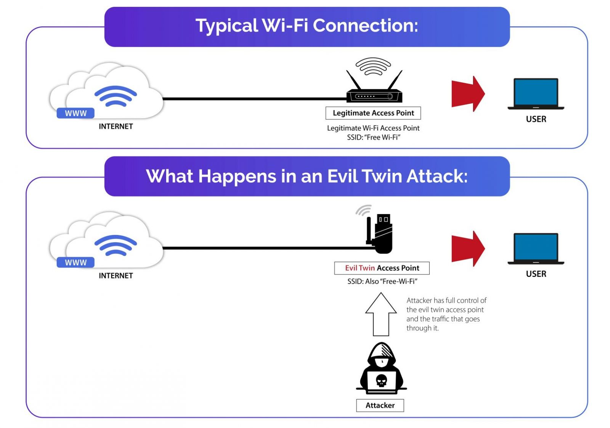

# 💀Evil twin attack💀
Evil Twin attack python implementation
# Created by: 
### Shmuel Lavian
### Ron Kolsky
### Avigael Abitbol
### Afik Peretz

### Explaination:
For this assignement we created hacking tool based on the "evil-twin attack" concept. 
An evil twin is a fraudulent Wi-Fi access point that appears to be legitimate for the user but is set up to eavesdrop on wireless communications.
The evil twin is the wireless LAN equivalent of the phising scam cyberattacks. 
This type of attack is used to steal unsuspecting users passwords, or personal information, either by monitoring their logins or through phishing, which consists of creating a fraudulent website and luring people to it.

### Method
The attacker snoops on Internet traffic using a bogus wireless access point.
The user connects to a seemingly innocent Wi-Fi network, after logging in they are directed to the login portal where they are asked to enter personal details "in order to complete איק login" and we steal this information.

 ### Visual explication:
  

### Hardware:
💻 Laptop  
📡 Network Card - TP_Link Archer T4U - Which allows to use moniter mode
⚡Operation system: Kali linux
 
 
